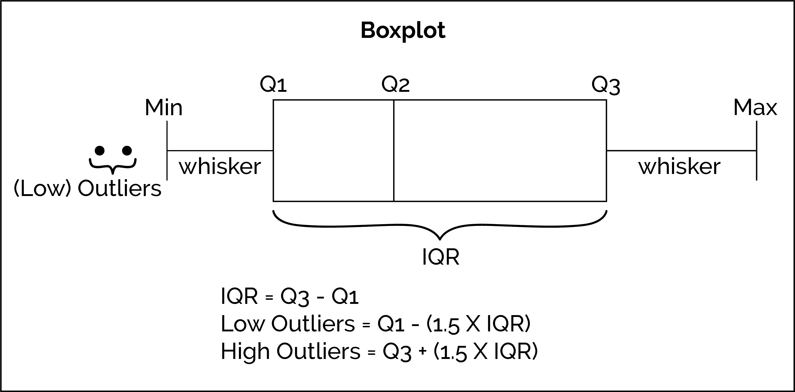

```{r setup, include=FALSE}
knitr::opts_chunk$set(echo = TRUE)
```

```{r, include=FALSE}
library(tidyverse)
library(psych)
library(mltools)
library(data.table)
library(caret)
```
[caret documentation](http://topepo.github.io/caret/index.html)


## Phase I
[Cereal_Data_Dictionary](https://www.kaggle.com/crawford/80-cereals)

```{r}
#Working to developed a model than can predict cereal quality rating. 

#Assuming we are able to optimizing and make recommendations how does this translate into a business context? 

# Inference versus Prediction 

# Independent Business Metric - Assuming that higher ratings results in higher sales, can we predict which new cereals that enter the market over the next year will perform the best?   

```

## Phase II 

### Scale/Center/Normalizing

```{r}
cereal <- read_csv("~/Desktop/ds3001/DS-3001-gitrepo/data/cereal.csv")
View(cereal)
attach(cereal)#is this a good idea? 
describe(cereal)
?scale
str(cereal)


(sodium_c <- scale(cereal$sodium, center = TRUE, scale = FALSE))#center but not standardized 
(sodium_sc <- scale(cereal$sodium, center = TRUE, scale = TRUE))#center and standardized 
#min-max scaling, placing the numbers between 0 and 1. 

###Build our own normalizer, which is maybe how I would go if given the option. If you need to do multiple columns use lapply. See this referred to as a min-max scaler function.

normalize <- function(x){
 (x - min(x)) / (max(x) - min(x))
}

(sodium_n <- normalize(cereal$sodium))

# However, before we can apply this we need to make sure our data classes are correct. 

(column_index <- tibble(colnames(cereal)))
#table(vitamins)
#What about mfr and type?
table(mfr)#we should collapse this factor, it has way too many categories G,K and everyone else. Usually don't want more than 5 categories  

cereal$mfr <- fct_collapse(cereal$mfr,
                           G="G", #New to Old
                           K="K",
                        other = c("A","N","P","Q","R")
                        )
column_index
table(name)

#Looks like columns 2,3,12 and 13 need to be converted to factors
cereal[,c(2,3,12,13)] <- lapply(cereal[,c(2,3,12,13)], as.factor)

str(cereal)

#Now we can move forward in normalizing the numeric values, create a index based on numeric columns: 

abc <- names(select_if(cereal, is.numeric))# select function to find the numeric variables 

#Use lapply to normalize the numeric values 

cereal[abc] <- as_tibble(lapply(cereal[abc], normalize))

str(cereal)

```


### One-hot Encoding 
[ML Tools One-Hot Overview](https://www.rdocumentation.org/packages/mltools/versions/0.3.5/topics/one_hot)

```{r}
# Next let's one-hot encode those factor variables/character 

?one_hot

cereal_1h <- one_hot(as.data.table(cereal),cols = "auto",sparsifyNAs = TRUE,naCols = TRUE,dropCols = TRUE,dropUnusedLevels = TRUE) 
View(cereal_1h)
```


### Baseline/Prevalance 

```{r}
#Essential the target to which we are trying to better with our model. 
describe(cereal_1h$rating)
(box <- boxplot(cereal_1h$rating, horizontal = TRUE)) 
box$stats
fivenum(cereal$rating)
?fivenum#thanks Tukey!

#added this a predictor versus replacing the numeric version
(cereal_1h$rating_f <- cut(cereal_1h$rating,c(-1,.43,1),labels = c(0,1)))

str(cereal_1h)
View(cereal_1h)
#So no let's check the prevalence 
(prevalence <- table(cereal$rating_f)[[2]]/length(cereal$rating_f))


```



### Initial Model Building: Decision Tree Style  

```{r}
# Training, Evaluation, Tune, Evaluation, Test, Evaluation
# Divide up our data into three parts, Training, Tuning, and Test

#There is not a easy way to create 3 partitions using the createDataPartitions

#so we are going to use it twice. Mostly because we want to stratify on the variable we are working to predict. What does that mean?  

#clean up our dataset a bit by dropping the original ranking variable and the cereal name which we can't really use. 

cereal_dt <- cereal_1h[,-c("name","rating")]
view(cereal_dt)

part_index_1 <- caret::createDataPartition(cereal_dt$rating_f,
                                           times=1,
                                           p = 0.70,
                                           groups=1,
                                           list=FALSE)
View(part_index_1)
dim(cereal_dt)

train <- cereal_dt[part_index_1,]
tune_and_test <- cereal_dt[-part_index_1, ]

#The we need to use the function again to create the tuning set 

tune_and_test_index <- createDataPartition(tune_and_test$rating_f,
                                           p = .5,
                                           list = FALSE,
                                           times = 1)

tune <- tune_and_test[tune_and_test_index, ]
test <- tune_and_test[-tune_and_test_index, ]


dim(train)
dim(tune)
dim(test)


```


#### Using Caret package to fit a C5.0 version of a decision tree
Setting up the cross validation
[Caret_Documentation](http://topepo.github.io/caret/train-models-by-tag.html#Tree_Based_Model)
```{r}
#Cross validation process 

fitControl <- trainControl(method = "repeatedcv",
                          number = 10,
                          repeats = 5, 
                          returnResamp="all") 

# number - number of folds
# repeats - number of times the CV is repeated, here it's 5 take the average of
# those 5 repeats


# Choose the features and classes

```

#### Training and Evaluation 

```{r}
features <- train[,-"rating_f"]
target <- train[,"rating_f"]

str(target)

set.seed(1984)
cereal_mdl <- train(x=features,
                y=target$rating_f,
                trControl=fitControl,
                method="C5.0",
                verbose=TRUE)

cereal_mdl

```

Tune and Evaluation 
```{r}
cereal_predict = predict(cereal_mdl,tune,type= "raw")

confusionMatrix(as.factor(cereal_predict), 
                as.factor(tune$rating_f), 
                dnn=c("Prediction", "Actual"), 
                mode = "sens_spec")

varImp(cereal_mdl)

plot(cereal_mdl)


grid <- expand.grid(.winnow = c(TRUE,FALSE), 
                    .trials=c(20,30,40), 
                    .model=c("tree","rules"))
set.seed(1984)
cereal_mdl_tune <- train(x=features,
                y=target$rating_f,
                tuneGrid=grid,
                trControl=fitControl,
                method="C5.0",
                verbose=TRUE)

cereal_mdl_tune
cereal_mdl

plot(cereal_mdl_tune)

# Want to evaluation again with the tune data using the new model 

cereal_predict_tune = predict(cereal_mdl_tune,tune,type= "raw")

confusionMatrix(as.factor(cereal_predict_tune), 
                as.factor(tune$rating_f), 
                dnn=c("Prediction", "Actual"), 
                mode = "sens_spec")


```

Test 

```{r}
cereal_predict_test = predict(cereal_mdl_tune,test,type= "raw")

confusionMatrix(as.factor(cereal_predict_test), 
                as.factor(tune$rating_f), 
                dnn=c("Prediction", "Actual"), 
                mode = "sens_spec")

```


