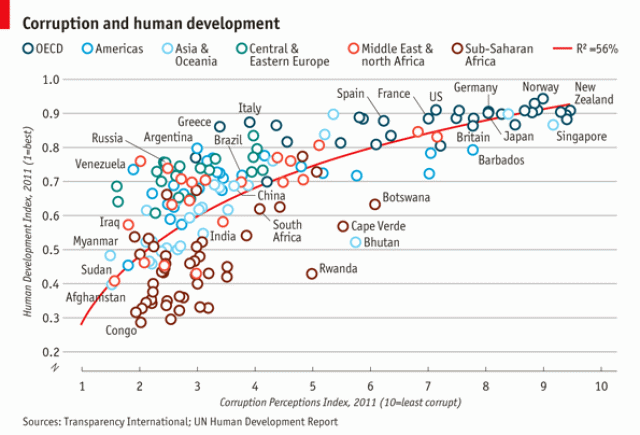

```{r setup, include=FALSE}
knitr::opts_chunk$set(echo = TRUE)
```

Recreate the Below Graphic using ggplot, Plotly, and flexdashboard.

Using the provided dataset (econ1) recreate the graphic to the best of your ability.  In doing so I want you to first create an outline together as a team using a rmarkdown file that articulates step by step the pieces you are adding to the graphic and a suggested code solution. Include the pseudocode at the top of the completed .rmd file for the graphic - Do this before you get started.

A few notes:

- Don't worry about putting the R2 value in the header, just place it in the graph.

- The country names won't "label" quite as well as the graphic, that's fine

- You will need to re-level the region variable to match the graphic

 

pseudo-code reference: https://www.youtube.com/watch?v=PwGA4Lm8zuE

Also, create functions of the graphical components as needed, comment heavily, and in general use high-quality coding practices. A quick reference on good programming practices in R is here: https://swcarpentry.github.io/r-novice-inflammation/06-best-practices-R/index.html

Once you are finished add the results to a 3-panel flexdashboard output.   Use the plotly wrapper (ggplotly) to make the plot interactive, include the data in an interactive Datatable (DT/datatable()), and create one additional plot of your choosing to match the format shared in class, publish to your Rpubs account.

All the lab submissions should, generally, be the same, so work together. You might think about assigning different components of the build to each member.

However, again every member submits their own .rmd file and Rpubs dashboard.

Submissions should include an executable .rmd file (cleanly knits) for the graphic and the link to your flexdashboard (some of the features might be stripped out when using plotly)

Sidenote - there will likely be code available online for this graphic or pieces of it at least, please don't actively search out this code. If you do, you won't learn anything, that being said if you get stuck of course search for references online, just please don't copy blocks of code.


